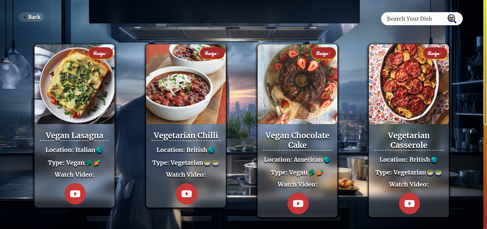
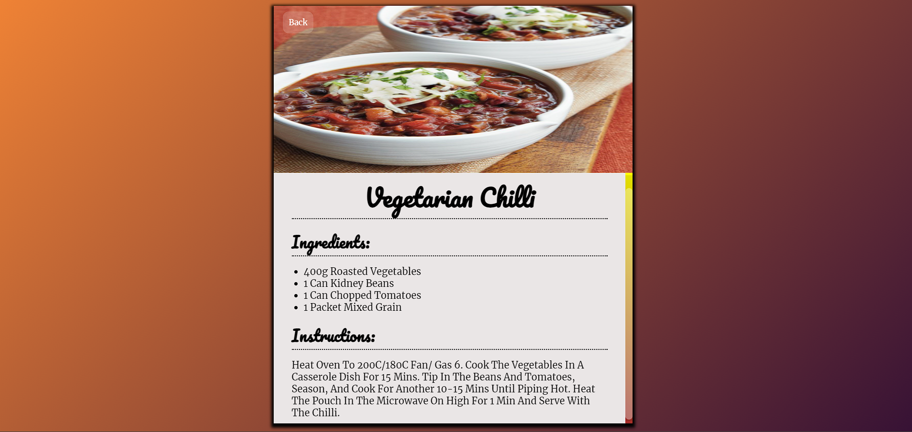

# 🍔 **Foodie Vibes** 🍲

Welcome to **Foodie Vibes**! This web application is your go-to destination for discovering delicious recipes from around the globe. With an intuitive interface and smooth animations, it’s designed to provide a delightful cooking experience.

## 🚀 **Features**

- 🍴 **Recipe Search**: Find recipes by searching for your favorite dishes.
- 🖼️ **Recipe Browsing**: Explore a diverse collection of recipes with images and details.
- 📜 **Detailed Recipe View**: Get ingredient lists, instructions, and video links.
- 🧩 **Error Handling**: Friendly “Not Found” page to guide you back if your search yields no results.
- 📱 **Responsive Design**: Optimized for a seamless experience on desktop and mobile devices.

## 🎬 **Screenshots**

### 🖥️ **Landing Page**

*The main landing page where you can search for recipes.*

### 🍲 **Recipe List**

*Browse recipes based on your search results.*

### 📜 **Recipe Details**

*Detailed view of a selected recipe including ingredients and instructions.*

## 🎨 **Technologies Used**

- **HTML5**: For structuring the content and layout of the application.
- **CSS3**: Modern styling techniques including Flexbox, Grid, and animations.
- **JavaScript (ES6+)**: For dynamic functionality and handling user interactions.
- **MealDB API**: Fetches recipe data based on user searches. [API Documentation](https://www.themealdb.com/api.php)

## 🛠️ **Getting Started**

1. **Clone the Repository**
   ```bash
   git clone <https://github.com/SkSahinParvej2001/Recipe-Finder-Website-Foodie-Vibes-.git>